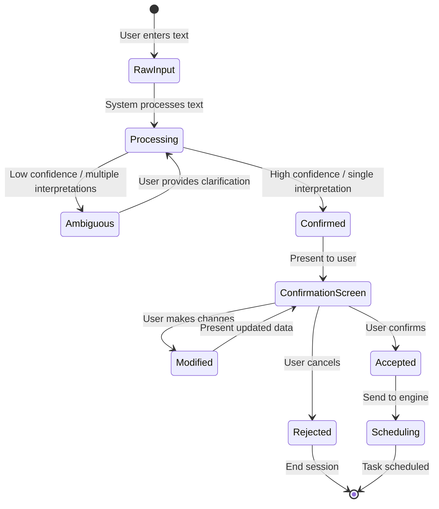
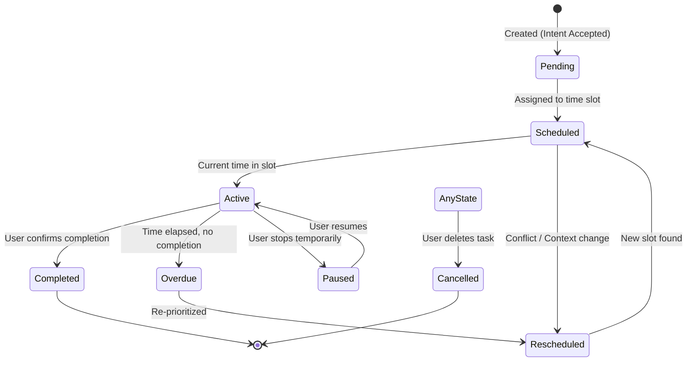
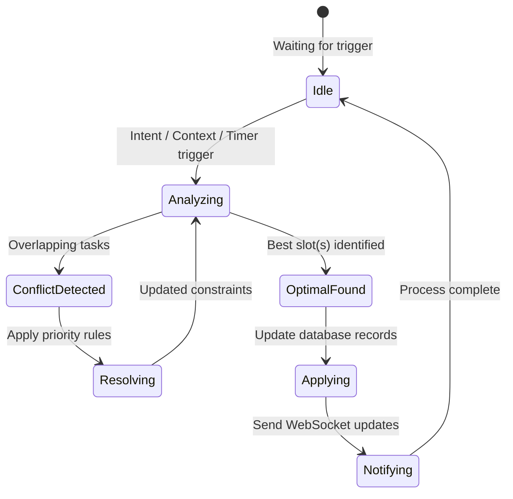
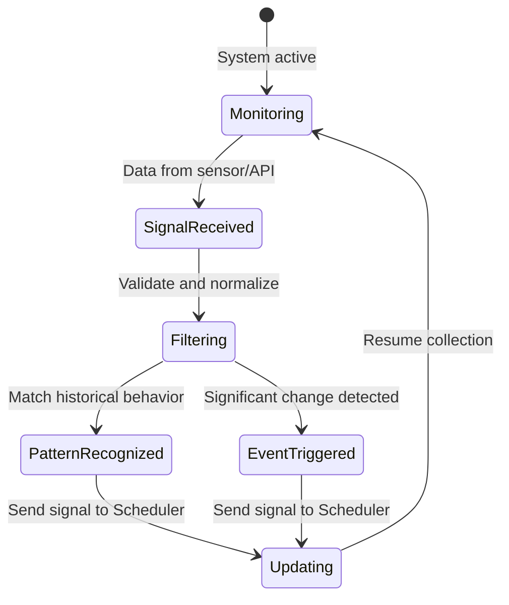
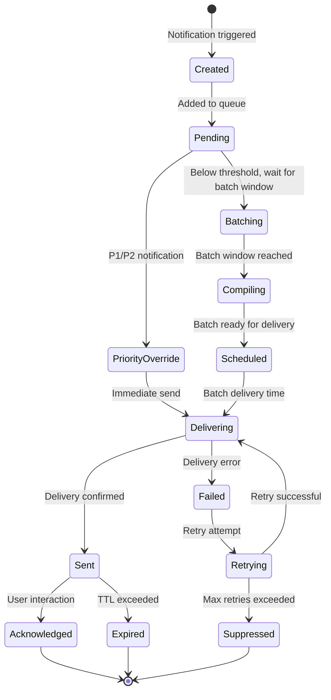

# Omni Core State Models

## 1. Intent Processing State Model

The Intent Processing Service transforms raw natural language input into structured data for the Scheduling Engine.

### State Diagram: Intent Processing

### State Transitions: Intent Processing

| Current State      | Event              | Action                 | Next State         |
| ------------------ | ------------------ | ---------------------- | ------------------ |
| [*]                | User Input         | Receive raw text       | RawInput           |
| RawInput           | NLP Analysis       | Run NLP models         | Processing         |
| Processing         | High Confidence    | Extract entities       | Confirmed          |
| Processing         | Low Confidence     | Generate questions     | Ambiguous          |
| Ambiguous          | User Clarification | Update context         | Processing         |
| Confirmed          | UI Render          | Show extracted data    | ConfirmationScreen |
| ConfirmationScreen | User Edit          | Apply changes          | Modified           |
| Modified           | UI Update          | Re-render data         | ConfirmationScreen |
| ConfirmationScreen | User Confirm       | Save structured intent | Accepted           |
| ConfirmationScreen | User Reject        | Clear input            | Rejected           |
| Accepted           | Schedule Trigger   | Call scheduling engine | Scheduling         |

---

## 2. Task Lifecycle State Model

The lifecycle of a task from creation to completion, including its status in the adaptive schedule.

### State Diagram: Task Lifecycle

### State Transitions: Task Lifecycle

| Current State | Event              | Action                     | Next State  |
| ------------- | ------------------ | -------------------------- | ----------- |
| [*]           | Intent Confirmed   | Create task record         | Pending     |
| Pending       | Schedule Run       | Assign start/end time      | Scheduled   |
| Scheduled     | Start Time Reach   | Update status, notify user | Active      |
| Active        | User Complete      | Record actual duration     | Completed   |
| Active        | Slot End (No Comp) | Flag as overdue            | Overdue     |
| Scheduled     | Context Change     | Re-evaluate slot           | Rescheduled |
| Rescheduled   | New Slot Found     | Update start/end time      | Scheduled   |
| Overdue       | Reprioritize       | Re-run scheduling          | Rescheduled |
| Active        | User Pause         | Suspend timer              | Paused      |
| Paused        | User Resume        | Restart timer              | Active      |
| AnyState      | User Delete        | Remove from schedule       | Cancelled   |

---

## 3. Scheduling Engine State Model

How the engine handles continuous rebalancing of the user's day.

### State Diagram: Scheduling Engine

### State Transitions: Scheduling Engine

| Current State    | Event             | Action                | Next State       |
| ---------------- | ----------------- | --------------------- | ---------------- |
| [*]              | System Start      | Initialize engine     | Idle             |
| Idle             | New Trigger       | Gather constraints    | Analyzing        |
| Analyzing        | Detect Overlap    | Identify conflicts    | ConflictDetected |
| Analyzing        | No Conflict       | Select best slots     | OptimalFound     |
| ConflictDetected | Rule Application  | Move/split tasks      | Resolving        |
| Resolving        | Constraint Update | Re-analyze schedule   | Analyzing        |
| OptimalFound     | Transaction Start | Update slot records   | Applying         |
| Applying         | WebSocket Send    | Push update to client | Notifying        |
| Notifying        | Success           | Clear event queue     | Idle             |

---

## 4. Context Service State Model

Processing incoming signals to inform scheduling.

### State Diagram: Context Service

### State Transitions: Context Service

| Current State     | Event            | Action                         | Next State        |
| ----------------- | ---------------- | ------------------------------ | ----------------- |
| [*]               | System Start     | Initialize context collectors  | Monitoring        |
| Monitoring        | Signal Data      | Receive sensor/API data        | SignalReceived    |
| SignalReceived    | Validation       | Check data format/schema       | Filtering         |
| Filtering         | Pattern Match    | Compare with historical data   | PatternRecognized |
| Filtering         | Anomaly Detected | Identify significant deviation | EventTriggered    |
| PatternRecognized | Confidence OK    | Signal within threshold        | Updating          |
| EventTriggered    | Severity High    | Trigger immediate notification | Updating          |
| EventTriggered    | Severity Low     | Log for batch processing       | Updating          |
| Updating          | Send Complete    | Dispatch to Scheduler          | Monitoring        |
| Monitoring        | Privacy Change   | Reconfigure collectors         | Monitoring        |
| Monitoring        | Data Timeout     | Retry with backoff             | SignalReceived    |

---

## 5. Notification Service State Model

Managing notification lifecycle from creation to delivery.

### State Diagram: Notification Service

### State Transitions: Notification Service

| Current State    | Event                | Action                     | Next State       |
| ---------------- | -------------------- | -------------------------- | ---------------- |
| [*]              | Notification Trigger | Create notification record | Created          |
| Created          | Queue Insert         | Add to priority queue      | Pending          |
| Pending          | Is Priority (P1/P2)  | Bypass batching            | PriorityOverride |
| Pending          | Batch Window Open    | Begin batch compilation    | Compiling        |
| Pending          | Threshold Not Met    | Continue waiting           | Batching         |
| Batching         | Timer Elapsed        | Finalize batch             | Compiling        |
| Compiling        | Batch Complete       | Schedule delivery          | Scheduled        |
| PriorityOverride | Delivery Attempt     | Send to gateway            | Delivering       |
| Scheduled        | Delivery Time        | Send batch to gateway      | Delivering       |
| Delivering       | ACK Received         | Mark as delivered          | Sent             |
| Delivering       | Error Response       | Increment retry counter    | Failed           |
| Failed           | Retry Count < 3      | Wait and retry             | Retrying         |
| Failed           | Retry Count >= 3     | Stop retry attempts        | Suppressed       |
| Retrying         | Retry Success        | Send to gateway            | Delivering       |
| Retrying         | Retry Failure        | Log error, stop            | Suppressed       |
| Sent             | User Opens           | Record engagement          | Acknowledged     |
| Sent             | TTL Expired          | Clean up notification      | Expired          |

---

This document provides technical clarity on how data flows and transitions between states in the Omni ecosystem. Engineering should use these models when implementing state management in the backend (services/models) and frontend (Redux/Context API).
